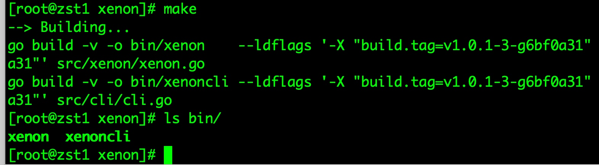

# xenon安装

### 下载xenon及安装

基于安装节点：

| 机器名 | ip | 安装角色 |
| --- | --- | --- |
| dzst141 | 172.18.0.10 | xenon,mysql |
| dzst142 | 172.18.0.11 | xenon,mysql |
| dzst143 | 172.18.0.12 | xenon,mysql | 

** vip: 172.18.0.100 **

vip绑定在 master上面

1. 这里使用源码部署：
   在172.18.0.10上的/data/dfile下操作
   
   \# git clone https://github.com/radondb/xenon.git
   
   \# cd xenon
   
   \# make 
   

确认bin目录下生成了: xenon，xenoncli 便大功告成。

2. 安装
为了简单，我把xenon部署到/data/xenon下面

\# mkdir /data/xenon

\# cp -r bin /data/xenon/

\# mkdir /etc/xenon

\# cp xenon.json /etc/xenon/

\# echo "/etc/xenon/xenon.json" >/data/xenon/bin/config.path

其它目录，这里先不做说明， 不影响使用。  

三个节点上按上面的方法部署xenon，也可以简化为：

\#scp -r /data/xenon 172.18.0.11:/data/

\#scp -r /data/xenon 172.18.0.12:/data/

每个节点完成部署一个xenon

>>>配置文件还要修改，晚一会修改完毕后再同步

